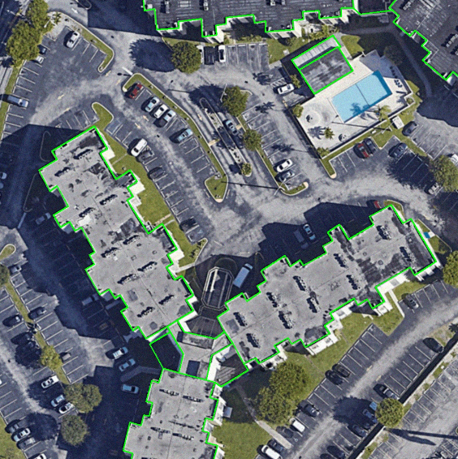
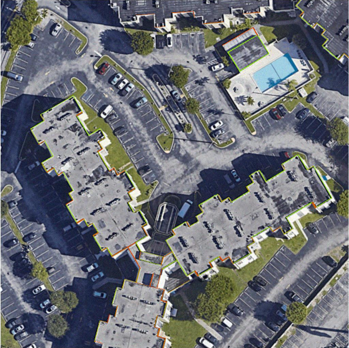
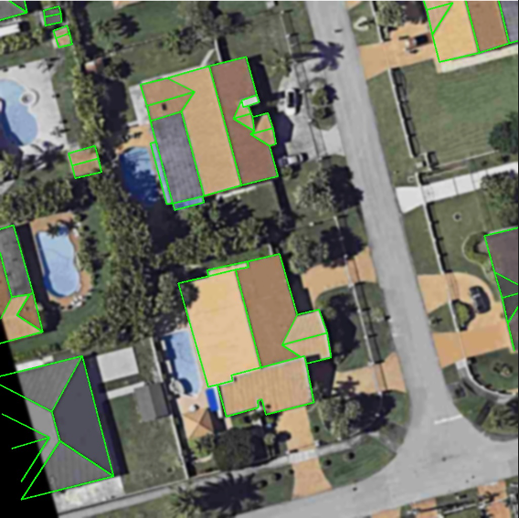

# BlockDetector

## Training With Multi-GPUs

```bash
python -m torch.distributed.launch --nproc_per_node=2 train.py  --batch-size 4
```

## Training With Single GPU

```bash
python train.py
```

## Results

<table align="center" style="border: 1px solid black;">
    <tr>
        <td align="center">
            
        </td>
        <td align="center">
            
        </td>
    </tr>
    <tr>
        <td align="center">
            
        </td>
        <td align="center">
            
        </td>
    </tr>
    <tr>
        <td align="center">
            Ground Truth
        </td>
        <td align="center">
            Predicted
        </td>
    </tr>
</table>
