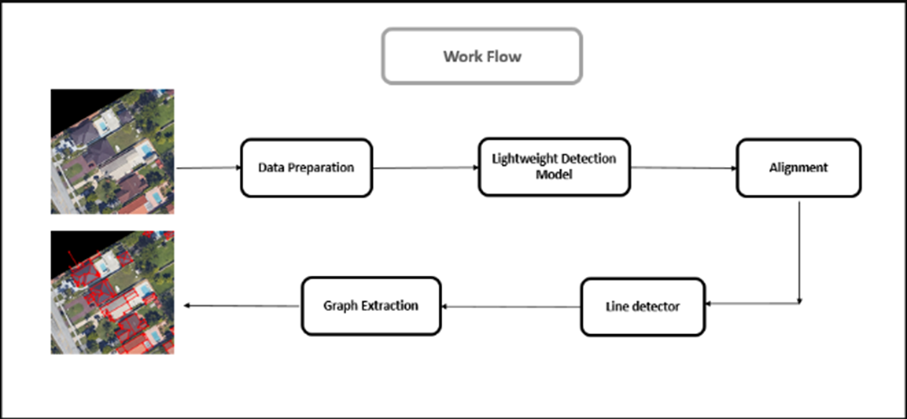
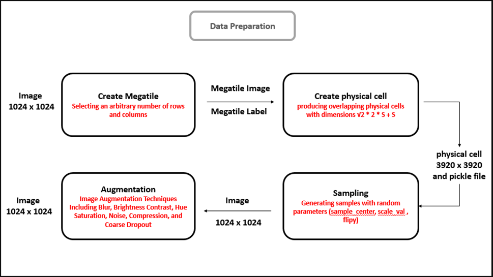

# Aerialytic - Advanced Aerial Image Analysis Framework

## Overview

Aerialytic is a comprehensive framework for analyzing aerial imagery, focusing on block detection, line detection, and physical cell analysis. This project implements various computer vision techniques using deep learning models to process and analyze aerial images. The framework combines the efficiency of F11-based models with advanced restoration networks to achieve robust and accurate results.



## Key Features

- Multi-class block detection in aerial images
- Advanced line detection with 2-class and 4-class classification
- Physical cell analysis and feature extraction
- Integration with state-of-the-art object detection models
- Efficient processing of large-scale aerial imagery
- Flexible configuration system for easy parameter tuning
- Advanced image restoration using UNet and AST networks

## Project Structure

The project is organized into several key components:

- `BlockDetector/`: Implements block detection in aerial images

  - Contains training scripts, model definitions, and validation tools
  - Uses YAML configuration for flexible parameter management
  - Supports keypoint pose estimation with 22 keypoints per block

- `Line_detect_2_cls/` & `Line_detect_4_cls/`: Line detection modules

  - Two-class and four-class line detection implementations
  - Specialized for different types of line detection scenarios
  - Supports horizontal, vertical, and diagonal line detection

- `PhysicalCells/`: Analysis of physical cells in aerial imagery

  - Focuses on cell detection and analysis
  - Implements specialized processing for physical cell features
  - Handles large-scale image processing efficiently

- `Ultralytics/`: Integration with Ultralytics YOLO framework

  - Leverages YOLO for object detection tasks
  - Custom implementations for aerial image processing
  - Optimized for real-time performance

- `Alligner/`: Image alignment and preprocessing

  - Handles image registration and alignment
  - Ensures consistent processing across different images
  - Supports rotation and scaling transformations

- `Megatile/`: Large-scale image processing

  - Manages processing of large aerial images
  - Implements tiling and stitching functionality
  - Optimizes memory usage for large datasets

- `Library/`: Shared utilities and common functions
  - Contains reusable components
  - Shared tools and helper functions
  - Common data processing utilities

## Technical Details

### Model Architecture

The framework utilizes a customized F11-based model with the following features:

- Feature maps at three resolutions: 32×32, 16×16, and 8×8
- Multi-scale detection framework
- Total of 21,504 grid cells for comprehensive detection
- Support for both object detection and keypoint pose estimation



### Training Configuration

- Batch size: 8
- Image size: 1024x1024
- Optimizer: SGD with learning rate scheduling
- Initial learning rate: 0.002
- Final learning rate: 0.01
- Training epochs: 2500
- IoU threshold: 0.9

## Installation

1. Clone the repository:

```bash
git clone https://github.com/yourusername/aerialytic.git
cd aerialytic
```

2. Install dependencies:

```bash
pip install -r requirements.txt
```

## Usage

Each module can be used independently or as part of the complete pipeline. Detailed usage instructions are available in each module's directory.

### [Block Detection](BlockDetector/README.md)

### [Line Detection 2 Class](Line_detect_2_cls/README.md) & [Line Detection 4 Class](Line_detect_4_cls/README.md)

### [OBB](Library/Model/Oriented_bbox/README.md)

## Future Work

- Enhanced image restoration process optimization
- Novel IoU computation method for line detection
- Reduction of input channels from 24 to 5 for improved efficiency
- Further optimization of real-time processing capabilities

## Contributing

Contributions are welcome! Please feel free to submit a Pull Request.

## License

This project is licensed under the MIT License - see the LICENSE file for details.

## Acknowledgments

- Special thanks to Fatemeh Yousefi for her contributions to this project
- Built with support from the Ultralytics YOLO framework
- Various open-source computer vision libraries and tools

## Contact

For questions and support, please open an issue in the GitHub repository.
